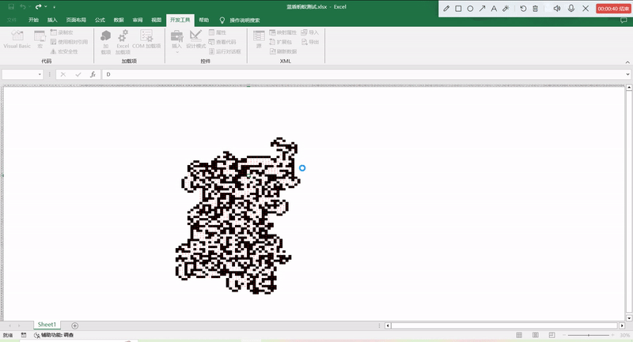

# Landon-Ant
- EN: You can use the attached code to observe the running effect of Langton Ants in Excel VBA.
It's the first time I programmed it in VBA. The first time I wrote such a program in VBA, the idea was to establish a loop, make conditional judgments in the current loop, and use the offset function to update the cell address, which is the position of the ant. Then set the time function to delay the execution of the next loop, hoping to achieve the animation effect. The programming process is very simple. Although the animation effect can be achieved, it is not smooth enough and the speed will be very slow. If you press the "Esc" button, you will be surprised to find that the program runs faster until the end condition is met. Before starting, you need to color the background white and input any of the four directions at the beginning: "U", "D", "L", "R".

- CN: 您可以使用附件的代码在Excel VBA中观察兰顿蚂蚁的运行效果。我第一次在VBA中编写这样的程序，思路是建立循环，在当前循环中进行条件判断，使用offset函数更新单元格地址，即蚂蚁的位置，然后设置时间函数延迟执行下一次循环，希望以此达到动画的效果。编程过程很简单。虽然可以达到动画效果，但是不够流畅，速度会很慢，如果按下Esc键，你会惊奇发现程序运行加快，直到满足结束条件。在开始前，你需要将背景色调成白色，并在开始的位置输入四个方向中的任意一个：“U”，“D”，“L”，“R”。

```vba
Application.Wait Now() + VBA.TimeValue("00:00:01")
```


